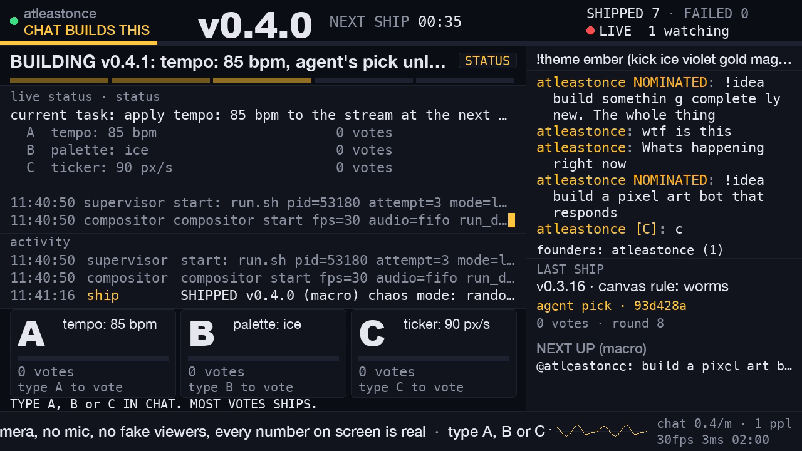
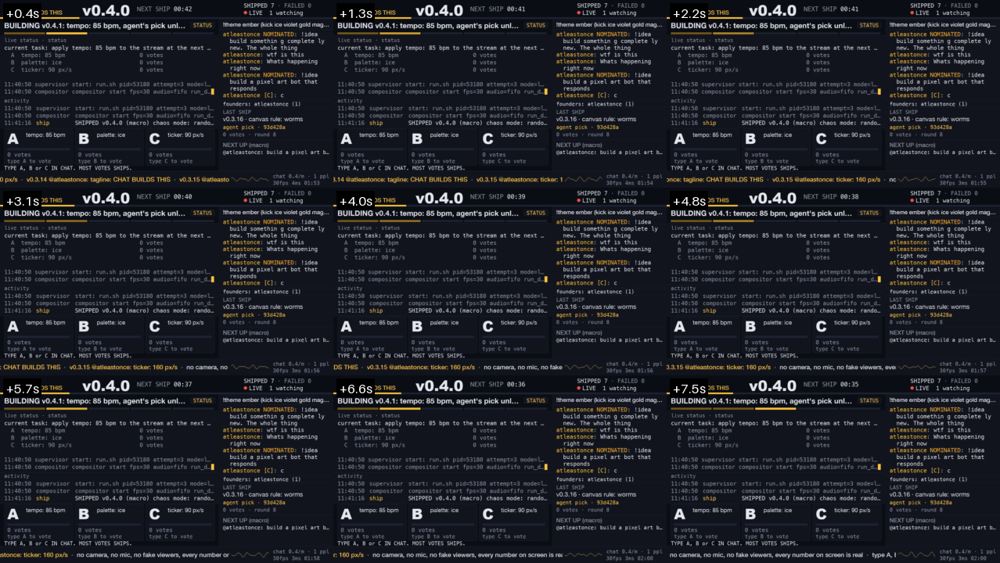
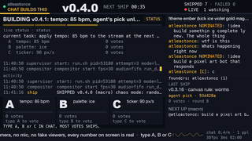

# SHIP IT LIVE — featured-slot pack for `atleastonce`

For whoever owns featured / homepage placement at Kick. One page, real numbers only.
Frame snapshot taken 2026-09-24 21:44 AEST (11:44 UTC), 22 minutes into the first live session of the show.
Figures revised 2026-09-25 00:45 UTC (10:45 AEST), during the **second** live session, which started at
00:35:05 UTC and was live (1 viewer) on the public API when this revision was written. The first session
ended at 11:46:05 UTC on 24 Sep because the owner had to leave (journal 012). Figures below are from the first
session unless marked "second session" or "at snapshot".
Every figure below is traceable to a runtime file or to `GET https://kick.com/api/v2/channels/atleastonce`;
the sources table at the bottom says which. Where a runtime file has since been overwritten (see "state.json"
in the sources table) the pack says so and cites the log instead.

---

## Channel

| | |
|---|---|
| Channel | **kick.com/atleastonce** (channel id 41659037, chatroom 41370704, broadcaster user id 42750175) |
| Category | **Software Development** (category id 34) |
| Live title (exact, 57 chars) | `AI rebuilds this stream every 3 min. Chat votes A, B or C` |
| Show name | SHIP IT LIVE |
| Language | English |
| Mature | No. No camera, no mic. The only user-generated text on screen is chat, and it goes through the moderation pipeline described below. |
| First live session | 2026-09-24 11:22:16 → 11:46:05 UTC (21:22 → 21:46 AEST), stopped by the owner. |
| Second live session | Started 2026-09-25 00:35:05 UTC (10:35 AEST), live at time of revision. Public API at 00:43 UTC: `is_live: true`, `viewer_count: 1`, `followers_count: 2`, same title and category. |

## The hook, one sentence

A stream whose only content is itself: every 3 minutes chat votes with a single letter on what changes next, AI agents apply or build it on screen, the version number ticks up, and the voter's name goes into the patch notes.

## What a viewer sees in the first 5 seconds

Decoded from Kick's own HLS playback of the live show (720p30 variant), not from the encoder side. The two PNGs here were verified byte-identical (`cmp`) to `run/probe/promo-1/` at 00:44 UTC on 25 Sep; that probe directory was removed from the run dir later that morning by another process, so these copies (sha256 in `README.md`) and `probe-promo-1.json` are now the record.

Reading the real frame top to bottom:

- **Header:** `atleastonce · CHAT BUILDS THIS`, a 56 px version number **v0.4.0**, `NEXT SHIP 00:35` counting down, `SHIPPED 7 · FAILED 0`, a red LIVE dot with `1 watching` (Kick's real viewer count at that moment). A full-width gold countdown bar under it shrinks toward zero. (The `7` includes one ship the live engine did not make; see "Ships" in the numbers table.)
- **Stage (left):** `BUILDING v0.4.1: tempo: 85 bpm, agent's pick unl…`, a 5-segment progress rail (PLAN › EDIT › TEST › SHIP › LIVE in the spec; segments only, no labels, in this build), the live status with the three options and their vote counts, and an activity feed of real process events (`supervisor start`, `compositor start`, `SHIPPED v0.4.0 (macro) chaos mode`).
- **Ballot (bottom left):** three cards, **A tempo: 85 bpm / B palette: ice / C ticker: 90 px/s**, each `0 votes · type A to vote`, then the instruction `TYPE A, B or C IN CHAT. MOST VOTES SHIPS.`
- **Chat (right):** the real chat pane. In this session that is the owner's own messages (`!idea build something completely new. The whole thing` and `!idea build a pixel art bot that responds`, both tagged NOMINATED; `wtf is this`; `Whats happening right now`; a `c` vote with a letter chip), `founders: atleastonce (1)`, a LAST SHIP card (`v0.3.16 · canvas rule: worms · agent pick · 93d428a · 0 votes · round 8`; this card is a known bug, not a real ship: a test run wrote into the shared state file, journal 012 finding 1) and NEXT UP (macro): `@atleastonce: build a pixel art b…`.
- **Footer:** a ticker (`no camera, no mic, no fake viewers, every number on screen is real · type A, B or C`), a real oscilloscope of the audio being sent, and `chat 0.4/m · 1 ppl · 30fps 3ms 02:00`.

The grid below is nine frames across 7.5 seconds of the same playback. The countdown runs 00:42 → 00:35, the bar shrinks and the ticker scrolls, so the frame is never static even when nobody is chatting.

**Thumbnail check (320x180).** `thumb_320.png` is `last_frame.png` downscaled with Pillow (LANCZOS) to the directory-tile size. At that size the version number **v0.4.0**, `NEXT SHIP 00:35` and the three ballot letters A / B / C still read; body text does not, which is by design (the header is the whole thumbnail hook, CONCEPT §2).

## Why it is featurable

The case is the format. The current numbers (next section) do not make it.

1. **A format Kick does not have yet.** The show is a live software artefact that the audience edits. Chat votes A, B or C every 180 seconds; the winning option ships, the version number increments, and the round restarts. On a longer clock an agent on duty takes a chat `!idea` and writes real code live (the first one, "chaos mode", was requested in chat at 11:29 UTC and was live as v0.4.0 at 11:41 UTC, commit 6781fce).
2. **Real numbers only, as a rule.** ADR-000 in the repo: no synthetic viewers, no bot chatters, ever. The viewer count on screen is Kick's API figure; the chat rate is real chat; when nobody votes the screen says so and labels the ship an agent pick (of the 6 micro-ship records in `ships.jsonl` from the first session, 3 are labelled `agent_pick` and 3 were picked by one real voter, the owner; all 4 ships so far in the second session are agent picks; all are visible in the patch notes). This is a stream that cannot be view-botted by its own pipeline.
3. **No camera, no mic, no person on screen.** Nothing to moderate visually. Software Development category, English, not mature.
4. **Built to run unattended, not yet proven to.** Rounds are owned by the compositor, not by an agent, so a 3-minute ship always lands; a supervisor relaunches the pipeline if it exits (2 s, then 4 s, then 8 s back-off). Caveat, honestly: the first session ran 24 minutes (11:22:16 → 11:46:05 UTC) before the owner stopped it to leave; the earlier test push ran 16 minutes; the second session has been up since 00:35 UTC on 25 Sep and had one ingest drop at 00:39 UTC (details under reliability).
5. **Every visitor is one keystroke from being on screen.** See next section.

## What happens to featured traffic

- **Lowest-friction chat action on the platform.** A bare `A`, `B` or `C` counts as a vote (the message must be exactly that letter, optionally `!a`). No command syntax to learn. The tally bar grows, the count increments and the voter's name appears under the card on the next frame (votes and voter names are not held; the chat line itself waits for the 3-second moderation hold). So: name on screen within a second of one keystroke.
- **Second step: `!idea <text>`.** The line is tagged NOMINATED in the chat pane and lands in the NEXT UP queue with the requester's name. When an agent is on duty it classifies the idea as an instant ballot option, a macro build, or `declined: <reason>` (shown, never silently dropped). When no agent is on duty the panel says so; micro-rounds continue regardless.
- **Third: `!theme <preset>`** repaints the whole stream for everyone on the next frame (`kick ember ice violet gold magenta cyan paper`, 60 s global cooldown, cooldown shown on screen). `!stats` shows a 10 s card of real numbers; `!help` shows the legend in the pinned strip for 20 s (each with a 30 s global cooldown).
- **Nothing replies in chat.** The stream does not post as the channel and no bot talks. The screen is the only reply, which is what makes every reaction public and immediate.
- **Empty state is honest.** If a featured viewer lands on an empty chat they see `founders: atleastonce (1)` and `0 votes · type A to vote`, not a padded number.

## Current numbers (honest)

| Metric | Value | Where it comes from |
|---|---|---|
| Followers | **2** | `followers` in every `metrics.jsonl` row; `followers_count` on the public API at 11:46 UTC on 24 Sep and 00:43 UTC on 25 Sep |
| Viewers at the last poll of the first session (11:46:05 UTC) | 2 | `metrics.jsonl` last live row |
| Peak concurrent viewers, first session | **3** (first reached 11:25:16 UTC; of 91 live polls: 12 at 3, 38 at 2, 37 at 1, 4 at 0) | `metrics.jsonl` `viewer_count`, 92 rows of 15 s polls 11:22:08 → 11:46:05 UTC |
| Second session, viewers so far (00:34:57 → 00:47:02 UTC, 47 polls) | peak **4**; 4 polls at 4, 4 at 3, 10 at 2, 18 at 1, 10 at 0; public API `viewer_count: 1` at 00:43 UTC | `run-live/metrics.jsonl`; public API |
| Viewers in the whole Software Development category | 8 at 11:46 UTC on 24 Sep; 8 again at 00:43 UTC on 25 Sep | `channel.json` `livestream.categories[0].viewers`; public API |
| Chat rate, first session | 0.4 msgs/min at snapshot (5 min window, from the frame footer), 0.0/min at session end; 1 unique chatter; 12 messages in the whole session (`chat.jsonl` holds 24 records for them because each message arrives twice, once via Pusher and once via the webhook path) | `chat_stats.json` `msgs_per_min_5m`, `total_session`; `chat.jsonl`; `last_frame.png`; journal 005 |
| Who is chatting | First session: only the owner, `atleastonce`; every chat record of that session is theirs. Second session so far: one message from one other account (not the owner) at 00:40:58 UTC, no votes. | `chat.jsonl` (25 records: 24 from the first session, 1 from 25 Sep); `chat_stats.json`; `run-live/chat_stats.json` `total_session: 1` |
| Ships, first session | **7 in the runtime records**, 0 failed: 6 micro (`ships.jsonl`) + 1 macro (v0.4.0). The on-screen counter and `state.json` read 8 because the engine adopted a test process's `v0.3.16` write (journal 012 finding 1). Final version `v0.4.1`. | `ships.jsonl`; `activity.jsonl` (`SHIPPED v0.4.0 (macro)`); journal 012 |
| Ships, second session so far | 4 (v0.4.2 → v0.4.5), all agent picks with 0 votes; the current on-screen version is `v0.4.5` | `run-live/ships.jsonl`; `run-live/state.json` `version.string` |
| Real votes cast, first session | 4 vote messages by the owner (`A`, `B`, `b`, `c`), 3 of which decided a ship. (`builders.json` shows a higher `votes` counter because every compositor start re-ingests the chat history and counts the same votes again; it is not cited as a real figure.) | `chat.jsonl`; `ships.jsonl` `picked_by`, `votes` |

Single-digit viewers, two followers, one chatter in the first session and that chatter was the owner; one non-owner chatter so far in the second. The pack does not argue otherwise.

## Technical reliability evidence

| Check | Result | Source |
|---|---|---|
| Transport | RTMPS to `fa723fc1b171.global-contribute.live-video.net:443`, TLS verification on (CA file set) | `supervisor.log` run.sh line; journal 003 |
| Encoder, final record of the last segment of the first session (11:40:50 → 11:46:05 UTC) | 9400 frames, 30.25 fps, 3142.6 kbit/s, `drop_frames=0`, `dup_frames=0`, speed 1.01x, `progress=end` | `ffmpeg_progress.txt` |
| Compositor render, last process of the first session (11:40:50 → 11:46:04 UTC) | final 3000-frame window: avg 3.5 ms, p95 11.5 ms, max 21.4 ms per 1280x720 frame, 0 over the 33.3 ms budget; 57 dup/dropped frames, all inside the first 245 frames after start; 9346 frames in 313 s = 29.8 fps; stopped clean; no panel disabled in this process. (The first process, 11:22 → 11:26, repeatedly disabled its `stage_body` / `activity_feed` panels for going over budget; that is what the 11:26 hotfix restart fixed.) | `logs/compositor.log` (`exit:` line 21:46:04 AEST); `activity.jsonl` (`compositor stop after 9346 frames (clean)`, panel-disabled events 11:23 → 11:26); journal 009 |
| Kick-side HLS probe (`promo-1`, fetched 11:42:51 UTC) | **PASS** on all 9 checks: 1280x720, 30.00 fps, h264 Main 2053 kbit/s, AAC 48 kHz stereo, no black, no frozen, no silence (mean -31.2 dBFS), decode ok, 14 segments at 2.0 s, download 4.2x realtime, latency 2.7 s, 9/9 grid frames | `probe/promo-1/probe.json` |
| Kick-side HLS probe, second session (`day2-1`, fetched 00:35:12 UTC 25 Sep) | **PASS** on all 9 checks: 1280x720, 30.00 fps, h264 Main 2351 kbit/s, AAC 48 kHz stereo, mean -30.4 dBFS, latency 2.7 s | `run-live/probe/day2-1/probe.json` |
| HLS variants Kick is serving | 720p30, 480p30, 360p30, 160p30, audio_only | `probe.json` `variants` |
| Kick API liveness, first session | `is_live: true` on 91 of 92 polls (the first poll, 11:22:08, was before the stream started); all 92 HTTP 200 | `metrics.jsonl` `is_live`, `http_status` |
| Kick API liveness, second session so far | `is_live: true` on 46 of 47 polls (the first, 00:34:57, was pre-start), including the three polls during the 00:39 ingest drop below; all 47 HTTP 200 | `run-live/metrics.jsonl` |
| Supervisor, first session | 3 process starts: 11:22:07, 11:26:54, 11:40:50 UTC. Both restarts were deliberate deploys (hotfix, then the chaos macro-ship), both exited rc=0 and relaunched in 2 s; Kick stayed live but viewers saw a 2-4 s stall each time. Final event 11:46:05 UTC: `stop: signal` from `stop.sh` on the owner's request, not a crash. Zero unplanned exits in this session. | `supervisor_events.jsonl`; journal 009, 010, 011 |
| Supervisor, second session | Start 00:34:55 UTC. At 00:39:05 Kick's ingest closed the RTMPS connection server-side (ffmpeg: `tls: Broken pipe` on the output, rc=224 after 254 s, encoder healthy at 30 fps up to that moment); the next two reconnects were refused (`tls: End of file` on connect, rc=251 after 5 s each) while the ingest still held the old session; attempt 4 connected at 00:39:35 and has run since. Supervisor back-off 2 s / 4 s / 8 s. Kick's API reported `is_live: true` throughout; viewers saw roughly 26-30 s of stalled video. | `run-live/supervisor_events.jsonl`; `run-live/logs/ffmpeg.log`; `run-live/metrics.jsonl` |
| Restart policy from 11:43 UTC 24 Sep | No compositor or ffmpeg restarts during a live show without the owner's go-ahead. Changes must be state-driven or hot-reloaded. | journal 011 |
| Uptime | First session 24 min live (11:22:16 → 11:46:05 UTC), ended by the owner; earlier test push 16 min (10:29-10:46 UTC); second session live since 00:35:05 UTC 25 Sep | `metrics.jsonl` `started_at`, last row; `supervisor_events.jsonl`; journal 003, 006, 012, 013; public API |

## Moderation safeguards: what is in the live build today

The spec (CONCEPT §7.1) defines a 9-step pipeline. This is what the code that is on air (`live-snapshot/stream/chat_bridge.py`, the same build in both sessions) does, versus what is planned.

**In the live build today**

- 3 s render hold on every chat line (`HOLD_S = 3.0`) so a mod `!hide` can beat the render. Votes count instantly and the voter's name appears under the ballot card on the next frame (a bare letter cannot be offensive; the name is the account's Kick username). `!hide <user>` removes that name from the card and the pane immediately.
- Hidden / paused check against `mod.hidden_users` and `mod.paused`.
- URL strip: any link becomes `[link]`.
- Non-BMP (emoji) strip and Kick emote normalisation (`[emote:id:name]` → `:name:`).
- Length caps: 120 chars displayed (60 for `!idea`, 140 for `!ask`).
- Per-user render rate 1 message per 2 s (excess lines dropped from the pane; votes still count).
- Mod commands from broadcaster/moderator badges: `!hide <user>`, `!unhide`, `!pause`, `!resume`, `!clear`; broadcaster-only `!kill` / `!unkill` replaces the chat pane, founders strip and voter names with `chat hidden by mod` on the next frame.
- Word filter and username filter are wired in (leet-normalised, hot-reloaded from `stream/moderation/blocklist.txt`; a username hit renders as `builder #N` in the pane).

**Not yet effective, stated plainly**

- **Blocklist: populated at 00:52 UTC 25 Sep.** The build went live with a comment-only list (`blocklist loaded: 0 terms` at every start up to 00:39:35 UTC), so the first ~50 minutes on air had no word filter. A 79-term slur / hate / sexual-term list (whole-token, leet-normalised, checked not to flag ordinary chat) was installed into the live build and hot-reloaded on the next message: `run-live/logs/compositor.log` `blocklist loaded: 79 terms` at 00:52:58 UTC. Until then the live protections were the URL strip, the caps, the rate limit, the 3 s hold and a human with `!hide` / `!pause` / `!kill`.
- The username filter does not yet apply to the voter names under the ballot cards, only to the chat pane; `!hide` does.
- `!ask` (on-screen Q&A) is disabled (`ask.enabled: false`) and not advertised.
- `!revert` is not in v1 and not advertised.
- The stream never posts to chat, so there is no bot output to moderate.

## Risks and asks

Risks

1. **Blocklist was empty for the first ~50 minutes on air** (above); populated with 79 terms at 00:52 UTC 25 Sep. A featured audience will test it within a minute, and voter names under the ballot cards still bypass the username filter (see moderation section).
2. **One moderator, and it is the streamer.** The owner is the only person with a broadcaster badge. `!kill` hides all chat text on the next frame, but someone has to be watching.
3. **One pending visible restart.** The enriched compositor (richer panels, the pixel-art idea `i-0003`) needs one more process swap, which stalls ingest 2-4 s. It should land before a featured window, never during it (journal 011, 013).
4. **One ingest drop, diagnosed as server-side.** At 00:39:05 UTC 25 Sep Kick's ingest closed the RTMPS connection (`ffmpeg.log`: `tls: Broken pipe` on the output while the encoder was healthy at 30 fps); the ingest then refused two reconnects (`tls: End of file` on connect) while it still held the old publisher session, and accepted the fourth attempt 26 s later. Recovered automatically by the supervisor; about 26-30 s of stalled video for viewers. Nothing on the encoder side caused it; a tighter first retry (1 s) is planned.
5. **Cosmetic truncation and wrapping** visible in the real frame: the stage title (`agent's pick unl…`) and pinned strip (`!theme ember (kick ice violet gold mag…`) clip; a chat line wraps mid-word (`somethin g complete ly`); ticker and activity lines can clip. Known, carried into the enrichment pass (journal 008).
6. **Unattended running is designed for but not yet proven.** First session 24 min, ended by the owner; second session in progress with one drop.
7. **Macro-ships need an agent on duty.** `agent.on_duty` was true from 11:38:51 UTC to the end of the first session, false overnight, and true again since 00:34:58 UTC on 25 Sep; without it the screen says so and micro-ships continue on their own.
8. **Shared-state contamination, mitigated, not yet fixed in code.** The `v0.3.16 · canvas rule: worms` LAST SHIP card in the real frame was written by a test process into the live state file, not by the live engine, and it also added one to the ship counter. The second session runs from an isolated run directory (`run-live/`) so tests cannot touch it (journal 013); the shared `run/state.json` was in fact overwritten again by a test at 00:37 UTC on 25 Sep, which is why this pack no longer cites it for session figures. The code guard is in the hardening pass.

Asks

1. A featured or homepage slot for a defined window, in Software Development, once items 1 and 3 above are closed.
2. If Kick has a standard blocklist the channel may use, that closes risk 1 in minutes.
3. Any guidance on thumbnail / title constraints for the featured tile so the header can be tuned to it (the header was designed for the 320x180 directory tile; `thumb_320.png` above is the check).

## Best time window

Nothing in the runtime data yet establishes a best hour: the channel has two sessions (24 Sep 21:22 AEST evening, 25 Sep 10:35 AEST morning) and no schedule history. What the data does say:

- The pipeline has no time-of-day constraint: no camera, no mic, rounds run compositor-owned.
- What a window needs is (a) the owner present with the broadcaster badge for moderation, (b) an agent on duty so `!idea` requests are classified and built, and (c) no deploy scheduled inside it.
- Proposed: the owner names a 1-2 hour window that satisfies (a) to (c), the stream is up at least 30 minutes before the slot starts, and the featured team picks whichever part of that window suits their rotation.

## Contact

Owner: Kick channel `atleastonce` (works at Kick). The owner fills in their own Slack handle / email before handing this over; the agent that drafted this pack did not insert personal contact details.

---

## Sources for every number in this pack

All paths under `~/.local/share/kick-live/run/` (first session) or `~/.local/share/kick-live/run-live/` (second session) unless noted. Repo docs under `kick-live/docs/`. Public API = `GET https://kick.com/api/v2/channels/atleastonce` with a browser user agent, called 2026-09-25 00:43 UTC.

| Claim | Source |
|---|---|
| Channel id 41659037, chatroom 41370704, user id 42750175 | `metrics.jsonl` (`channel_id`, `chatroom_id`), `channel.json` (`user_id`), public API `id`, `user_id`, `chatroom.id` |
| Category Software Development, id 34 | `metrics.jsonl` `category`; `channel.json` `livestream.categories[0].id`; public API; journal 005 |
| Title string, 57 chars | `metrics.jsonl` `title`; `channel.json` `session_title`; `probe.json` `channel_title`; public API `livestream.session_title`; CONCEPT §1 |
| Language English, not mature | `channel.json` `livestream.language`, `is_mature`; public API |
| First session 11:22:16 → 11:46:05 UTC, 24 min | `metrics.jsonl` `started_at` and last row `ts`; `supervisor_events.jsonl` `stop`; `activity.jsonl` `pipeline stopped`; journal 012 |
| Second session started 00:35:05 UTC 25 Sep, live at 00:43 UTC with 1 viewer | public API `livestream.start_time`, `viewer_count`; `run-live/metrics.jsonl` `started_at`; `webhooks.jsonl` `livestream.status.updated`; journal 013 |
| Followers 2 | `metrics.jsonl` `followers` (all 92 rows); `run-live/metrics.jsonl` (all rows); public API `followers_count` |
| Viewers 2 at last poll, peak 3, distribution 12/38/37/4 | `metrics.jsonl` `viewer_count` (92 rows, 91 live, 15 s polls) |
| Second-session viewers: 47 polls, peak 4, distribution 4/4/10/18/10 | `run-live/metrics.jsonl` rows from 00:34:57 UTC |
| Category viewers 8 | `channel.json` `livestream.categories[0].viewers` (ts 11:46:05 UTC); public API `livestream.categories[0].viewers` at 00:43 UTC |
| Chat 0.4/min at snapshot, 0.0 at end, 1 unique, 12 messages, 24 records | `last_frame.png` footer; `chat_stats.json` `msgs_per_min_5m`, `unique_chatters_15m`, `total_session`; `chat.jsonl` (12 Pusher records with `username: atleastonce`, 12 webhook copies); journal 005, 012 |
| Only chatter in the first session is the owner; one other account on 25 Sep | `chat.jsonl` (25 records; the one dated 2026-09-25 is from a different `user_id`); `chat_stats.json` `last_username`; `run-live/chat_stats.json` |
| 7 ships in records, counter reads 8, v0.4.1 | `ships.jsonl` (6 micro records); `activity.jsonl` (`SHIPPED v0.4.0 (macro) … 6781fce`; also the foreign `v0.3.16` event at 11:40:30 from a `/tmp` run dir); journal 012 finding 1; `last_frame.png` header |
| Second-session ships v0.4.2 → v0.4.5, all agent picks | `run-live/ships.jsonl`; `run-live/activity.jsonl` |
| Ship records, agent picks vs owner picks | `ships.jsonl` `agent_pick`, `picked_by` |
| Chaos macro-ship timing, commit 6781fce | `state.json` `ideas[i-0002].ts` 11:29:25Z, `macro.last_reload` 11:41:16Z commit 6781fce (these fields are unchanged in `run-live/state.json`); `activity.jsonl`; journal 010 |
| 4 real vote messages, 3 decided a ship | `chat.jsonl` (`A`, `B`, `b`, `c`); `ships.jsonl` `picked_by: atleastonce`, `votes: 1` on v0.1.1, v0.3.14, v0.3.15 |
| `builders.json` vote counter not cited | `builders.json` `votes: 10` (24 Sep) vs `run-live/builders.json` `votes: 26`, `sessions: 7`; `compositor.log` `ingested 12 historical chat messages` on every start |
| Encoder 9400 frames, 30.25 fps, 3142.6 kbit/s, 0 drop / 0 dup | `ffmpeg_progress.txt` (final `progress=end` block) |
| Compositor 3.5 ms avg, 11.5 ms p95, 21.4 ms max, 57 dup/dropped, 9346 frames clean stop, 29.8 fps derived | `logs/compositor.log` lines 21:41:00 → 21:46:04 AEST; `activity.jsonl` (`compositor start` 11:40:50.717Z, `compositor stop after 9346 frames (clean)` 11:46:04.153Z) |
| Panels disabled in the first process | `activity.jsonl` `panel stage_body disabled` / `panel activity_feed disabled` events 11:23:44 → 11:26:43 UTC; journal 009 |
| Probe PASS (both sessions) and all their figures | `probe/promo-1/probe.json` (read 00:44 UTC 25 Sep; excerpt preserved here as `probe-promo-1.json` because the original directory was removed afterwards); `run-live/probe/day2-1/probe.json` (`checks`, `video`, `audio`, `manifest`, `latency_s`, `variants`) |
| 91/92 and 46/47 live polls, all HTTP 200 | `metrics.jsonl`, `run-live/metrics.jsonl` `is_live`, `http_status` |
| RTMPS endpoint, port 443, CA verification | `logs/supervisor.log` run.sh line; journal 003 |
| Supervisor starts/restarts, first session: rc=0, 2 s, final `stop: signal` | `supervisor_events.jsonl`; `logs/supervisor.log` |
| Supervisor, second session: rc=224 at 00:39:05, rc=251 twice, back-off 2/4/8 s, attempt 4 at 00:39:35 | `run-live/supervisor_events.jsonl`; `run-live/logs/supervisor.log`; `run-live/logs/ffmpeg.log` (`Broken pipe`, `bad length`, `Error opening output`) |
| 2-4 s ingest stall per restart; no-restart rule | journal 011 |
| Earlier test push 16 min | journal 003 (`started_at 10:29:40Z`), 006 (offline 10:46:12Z) |
| Moderation steps in the live build | `~/.local/share/kick-live/live-snapshot/stream/chat_bridge.py` (docstring, `HOLD_S`, `RATE_S`, `CAP_*`, `MOD_CMDS`, `BROADCASTER_ONLY`, `clean_text`, `ingest`, `_apply_mod`, `tallies`, `visible`); `panels/chat_pane.py`, `panels/founders.py`, `panels/ballot.py` (`chat hidden by mod`) |
| `!stats` 10 s, `!help` 20 s, 30 s cooldowns | `chat_bridge.py` `CMD_COOLDOWN_S`, `stats_until`, `help_until`; CONCEPT §7 |
| Blocklist 0 terms | `logs/compositor.log` (`blocklist loaded: 0 terms` at 21:22:08, 21:26:54, 21:40:50 AEST); `run-live/logs/compositor.log` (10:34:55, 10:39:12, 10:39:21, 10:39:35 AEST) |
| `ask.enabled: false` | `state.json`, `run-live/state.json` `ask.enabled` |
| `agent.on_duty` timeline | `activity.jsonl` (`claude on duty` 11:38:51Z, `agent off duty` 11:46:04Z and 2026-09-25T00:33:15Z); `run-live/activity.jsonl` (`claude on duty` 00:34:58Z); `run-live/state.json` `agent.on_duty: true` |
| LAST SHIP `v0.3.16` card is a test-contamination bug | journal 012, open finding 1; `activity.jsonl` 11:40:24 → 11:40:30 (`run_dir=/tmp/cp-panels-stage/st3`, then the `v0.3.16` ship) |
| Shared `state.json` overwritten again on 25 Sep | `state.json` `updated_ts` 2026-09-25T00:37:27Z, `round.opened_ts` 00:37:22Z; `activity.jsonl` `compositor start … run_dir=/tmp/cp-stage-port-baseline` at 00:37:22Z; journal 013 |
| Isolated `run-live/` for the second session | journal 013; `run-live/logs/supervisor.log` |
| Theme presets, `!revert` not in v1, idea classes, `!kill` behaviour, 5-step rail, 56 px header | `live-snapshot/stream/layout.py` `PRESETS`, `header_center`; `agents/duty.py` `classify`; CONCEPT §3 (rows 2, 6), §5, §7 |
| 320x180 legibility is a QA check, not a compositor feature | CONCEPT §2 ("Hook in 5 seconds"), §3 ("Legibility gates (QA agent, every round)") |
| Frame contents, truncation | `last_frame.png`, `frame_grid.png` in this folder (byte-identical to `probe/promo-1/` at 00:44 UTC 25 Sep, before that directory was removed); journal 008 |
| No fake engagement rule | `docs/decisions/ADR-000-no-fake-engagement.md` |
| Owner posts, agent drafts | journal 002 |
